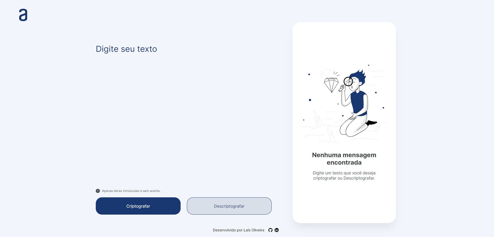
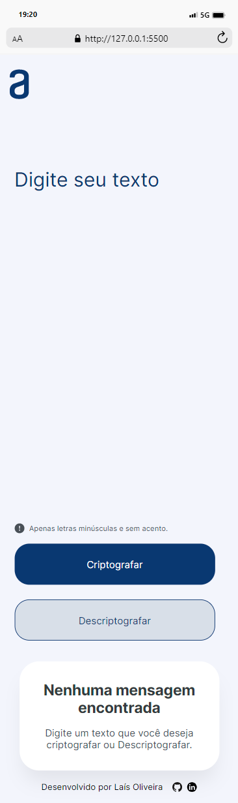

<h1>

   💥 | 1º CHALLENGE ONE ORACLE - Turma 6 💥 
</h1>
  <h3> O Desafio </h3> 
  
 - Este é um site desenvolvido para o 1º Desafio do programa ORACLE NEXT EDUCATION (ONE).
 - Aqui você encontra uma ferramenta de criptografia e descriptografia de textos, com a funcionalidade de copiar o resultado.

---

## 🙆‍♀️ Veja como é fácil usar o site :

<ul>
  <li> Insira o texto que você deseja manipular. Pode ser qualquer mensagem, frase ou conteúdo que você queira proteger ou decifrar.</li>
  <li> Em seguida, escolha uma das opções disponíveis: Criptografar ou Descriptografar. Clique no botão correspondente à ação que você deseja realizar.</li>
  <li> Após clicar no botão, o resultado da operação selecionada será exibido na caixa ao lado. Você verá o texto transformado de acordo com sua escolha.</li>
</ul>

---

## 💅 O site possui os seguintes recursos:

<ul>
  <li> Entrada e saída de texto: Você pode inserir o texto que deseja manipular e ver o resultado na mesma página</li>
  <li>Responsividade para diferentes telas: O site se adapta tanto a dispositivos móveis, como smartphones, quanto a telas maiores, como desktops e laptops.;</li>
  <li> Botão de cópia: Com um simples clique, você pode copiar o texto resultante e colá-lo em outro lugar, facilitando o compartilhamento ou uso posterior.</li>
  <li>Vlibras para acessibilidade: O site inclui suporte ao Vlibras, uma ferramenta de tradução de texto para Libras (Língua Brasileira de Sinais), tornando-o mais acessível para pessoas com deficiência auditiva.</li>
</ul>

---

## 💾 As seguintes tecnologias foram utilizadas no desenvolvimento do site:

- HTML5: Utilizado para a estruturação e marcação do conteúdo do site.
- CSS3: Utilizado para estilizar e personalizar a aparência do site, incluindo o design responsivo e o modo escuro.
- JavaScript: Utilizado para adicionar interatividade e funcionalidades dinâmicas ao site, como a criptografia e descriptografia de textos, além do botão de cópia.
- Bootstrap: Um framework front-end utilizado para agilizar o desenvolvimento e garantir a responsividade do site em diferentes dispositivos.
- Vlibras: Uma tecnologia utilizada para implementar o suporte ao Vlibras, proporcionando acessibilidade para pessoas com deficiência auditiva.

---

## 👀 Durante o projeto, foram enfrentadas algumas dificuldades, incluindo:

- Aplicar responsividade: Foi desafiador garantir que o site se adaptasse adequadamente a diferentes tamanhos de tela, desde dispositivos móveis até telas maiores. Foi necessário ajustar o layout e utilizar técnicas de design responsivo para oferecer uma experiência consistente em todas as plataformas.

- Alinhar elementos com flexbox: O alinhamento e posicionamento dos elementos na página utilizando flexbox pode ser complexo. Foi necessário compreender e aplicar corretamente as propriedades do flexbox para alcançar o layout desejado, garantindo que os elementos se ajustassem corretamente em diferentes resoluções de tela.

- Funções e validações de texto: Implementar as funcionalidades de criptografia, descriptografia e validações de texto exigiu um entendimento sólido de algoritmos de criptografia e manipulação de strings. Foi necessário desenvolver funções adequadas para realizar as operações desejadas, além de considerar casos especiais e realizar validações para garantir a correta manipulação dos textos.

<h3 align="left">VERSÃO WEB</h3>

  

---

<h3>VERSÃO MOBILE</h3>

  

# ChallengeONE # desafio-one
